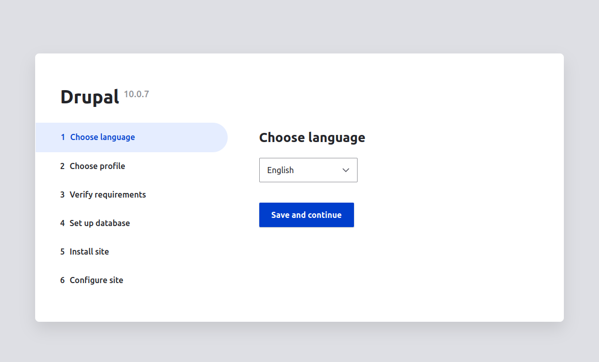
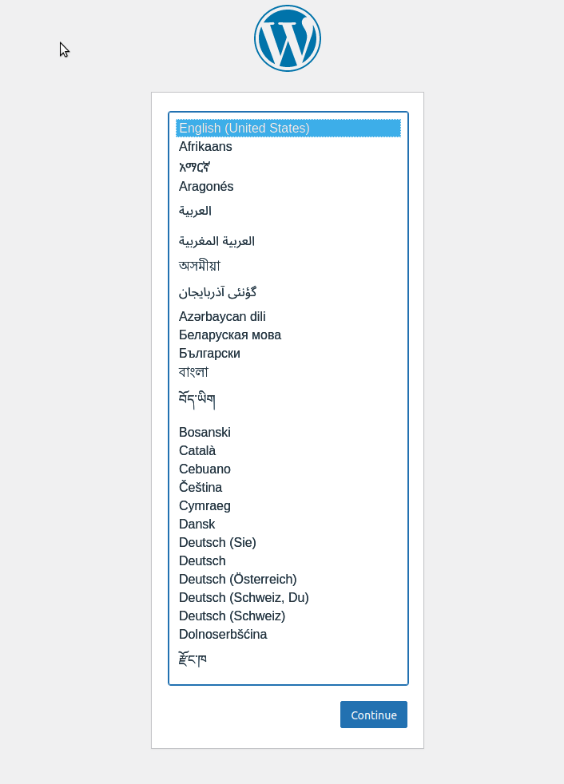

# Docker Práctica 3

## Parte 1

Creamos un fichero docker compose con estos valores.

```yml
services:
  drupal:
    image: "drupal"
    ports:
      - "81:80"
    volumes:
      - volumenDocker:/var/www/html/sites
    restart: always 
  mysql:
    image: "mysql"
    environment:
      - MYSQL_DATABASE=drupal
      - MYSQL_USER=user
      - MYSQL_PASSWORD=password
      - MYSQL_ROOT_PASSWORD=password
    restart: always
volumes:
  volumenDocker:
```

Lo siguiente que tenemos que hacer es ejecutar

```bash
    docker-compose up -d
```

Los contendores se ponen en marcha.
Accedemos a localhost:81


## Parte 2

Creamos un fichero DockerFile con estos valores.

```yml
services:
  wordpress:
    image: "wordpress"
    ports:
      - "82:80"
    networks:
      - redDocker
  mariadb:
    image: mariadb
    networks:
      - redDocker
    environment:
      - MARIADB_ROOT_PASSWORD=password
networks:
  redDocker:
```

Lo siguiente que tenemos que hacer es ejecutar

```bash
    docker-compose up -d
```

Accedemos a la ruta localhost:82 y veremos la pantalla de configuración de wordpress.

